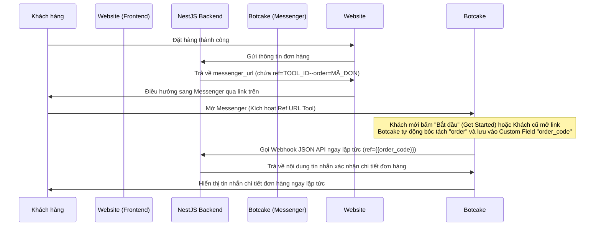

# Hướng Dẫn Cấu Hình Botcake.io Cho Luồng Xác Nhận Đơn Hàng

Tài liệu này hướng dẫn chi tiết cách thiết lập công cụ **Messenger Ref URL** và **Webhook JSON API** trên [Botcake.io](https://botcake.io) để tích hợp với hệ thống NestJS Backend. Dành cho lập trình viên, quản trị viên hệ thống hoặc AI agent tham khảo khi cần chuyển đổi Fanpage hoặc cài đặt mới.

---

## 📌 Sơ Đồ Hoạt Động (Flow Tối Giản)


---

## 🛠️ Hướng Dẫn Cấu Hinh Từng Bước Trên Botcake

### Bước 1: Tạo Custom Field Để Lưu Mã Đơn Hàng
Để lưu trữ mã đơn hàng động từ URL chuyển sang, bạn cần tạo một Custom Field lưu thông tin này:
1. Đăng nhập vào **Botcake.io** -> Chọn Fanpage của bạn.
2. Truy cập mục **Cấu hình** (Settings) ở menu bên trái -> Chọn **Custom Field** (Trường tùy chỉnh).
3. Nhấp vào nút **Tạo custom field** (User Field):
   - **Tên trường**: `order_code` (hoặc tên bất kỳ bạn muốn).
   - **Kiểu dữ liệu**: `Text` (Văn bản).
   - Nhấn **Lưu** để hoàn tất.

---

### Bước 2: Thiết Lập Công Cụ Messenger Ref URL
Đây là công cụ sinh liên kết `m.me` để khách hàng click từ website chuyển hướng sang Messenger.
1. Truy cập mục **Công cụ** (Growth Tools) ở menu bên trái -> Nhấp **Tạo mới** -> Chọn **Messenger Ref URL**.
2. Đổi tên công cụ thành tên dễ nhớ (ví dụ: `Link xác nhận đơn hàng`).
3. Chuyển sang tab **2. Thiết lập (Setup)**:
   - Trong bảng **Lưu Payload vào Custom Field** (Query Params):
     - Nhấp **+ Query Params** để thêm một dòng mới.
     - Ô **Key**: Gõ chữ `order` (đây là từ khóa cấu trúc trong URL code backend tạo ra: `ref=TOOL_ID--order=MÃ_ĐƠN`).
     - Ô **Custom Field**: Chọn trường `order_code` vừa tạo ở Bước 1 từ menu thả xuống.
4. ⚠️ **BẮT BUỘC**: Nhấn nút **Lưu (Save)** màu xanh dương ở góc trên bên phải màn hình. Nếu không bấm nút này, cấu hình ánh xạ tham số sẽ không hoạt động.
5. Ghi lại **ID của công cụ** này (nằm ở đuôi của URL chỉnh sửa trên trình duyệt hoặc hiển thị trong link Ref mặc định, ví dụ: `https://botcake.io/.../tools/2567308` thì ID là `2567308`).

---

### Bước 3: Cấu Hình Gọi Webhook Backend Tự Động (Không Nút Bấm)
Thiết lập để chatbot gọi ngay API backend và trả về đơn hàng khi khách hàng vừa mở link (hoặc bấm Bắt đầu).
1. Quay lại tab **1. Opt-in Message** (hoặc Luồng tin nhắn liên kết với Ref URL) -> Bấm **Chỉnh sửa (Edit)**.
2. Nếu kịch bản có sẵn tin nhắn văn bản hay nút bấm, hãy **xóa bỏ hoàn toàn** (rê chuột vào ô chữ, chọn biểu tượng Thùng rác để xóa, xóa luôn các nút bấm đi kèm).
3. Tại phần **Thêm một nội dung**, bấm vào **Nhiều hơn** (biểu tượng dấu `+`) -> Chọn **JSON API** (Webhook). Một khối màu xanh lá cây `Request Added` sẽ xuất hiện.
4. Click vào khối **Request Added** để cấu hình:
   - **Phương thức (Method)**: Chọn `POST`.
   - **URL Webhook**: `https://<DOMAIN_CỦA_BẠN>/orders/botcake-webhook`
   - Chuyển sang tab **Params** (Tham số):
     - Thêm tham số: **Key** là `ref`.
     - **Value**: Chọn biến Custom Field `order_code` bằng cách nhấp vào biểu tượng dấu `{}` bên cạnh ô nhập liệu và chọn đúng biến hệ thống.
5. Nhấn **Xong** ở góc dưới bên phải bảng request.
6. ⚠️ **BẮT BUỘC**: Nhấn nút **Lưu (Save)** màu xanh dương ở góc trên bên phải màn hình chỉnh sửa lớn để xuất bản kịch bản mới.

---

### Bước 4: Thiết Lập Đồng Bộ Quyền & Nút Bắt Đầu (Cho Khách Hàng Mới)
Để kịch bản chạy chính xác đối với khách hàng chưa từng nhắn tin cho Fanpage:
1. Truy cập mục **Cấu hình** (Settings) ở menu bên trái -> Chọn **Cấu hình chung** (General Settings).
2. Tại phần **Tùy chỉnh Bot**:
   - Tìm dòng **Bật nút "Bắt đầu"** (Sử dụng nút "bắt đầu" cho khách hàng mới).
   - Gạt công tắc này sang bên phải chuyển thành **Màu xanh (Bật)**.
3. Cuộn xuống phần **Vùng Nguy hiểm** -> Dòng **Làm mới Bot** -> Nhấn nút **Làm mới** để đồng bộ cấu hình này sang Facebook.

*(Sau khi hoàn thành cấu hình này, luồng sẽ tự động kích hoạt liền mạch cho cả khách mới bấm "Bắt đầu" và khách cũ mở link).*

---

## 💻 Cấu Hình Phía NestJS Backend (Khi Đổi Page Hoặc Đổi ID Tool)

Khi bạn chuyển giao sang Fanpage chính thức khác hoặc tạo mới công cụ Ref URL mới, bạn cần cập nhật các thông tin cấu hình trong dự án NestJS như sau:

### 1. File Môi Trường `.env`
Cập nhật các biến môi trường sau cho phù hợp với Fanpage mới:
```env
# ID của Fanpage Facebook mới
FB_PAGE_ID="ID_TRANG_FACEBOOK_MỚI_CỦA_BẠN"

# Token kết nối của Trang (Dùng để gửi tin nhắn thông báo cho Admin/Chủ quán, không ảnh hưởng đến tin nhắn gửi khách hàng vì gửi khách hàng đã được trả về qua Webhook JSON API)
FB_PAGE_ACCESS_TOKEN="token_truy_cap_trang_moi"

# PSID của quản trị viên nhận thông báo đơn hàng mới
FB_ADMIN_PSID="psid_admin_moi"
```

### 2. Cập Nhật Tool ID Trong Backend
Nếu ID của công cụ Messenger Ref URL trên trang mới khác với `2567308`, bạn cần sửa đổi giá trị này trong code backend:

Mở file [order.service.ts](file:///d:/freelancer/YNuQuan/apps/api/src/order/order.service.ts):
1. **Cập nhật hàm tạo URL**:
   Tìm dòng tạo `messengerUrl` (khoảng dòng 78):
   ```typescript
   // Thay '2567308' bằng ID công cụ mới của bạn
   const messengerUrl = `https://m.me/${process.env.FB_PAGE_ID}?ref=NEW_TOOL_ID--order=${orderCode}`
   ```
2. **Cập nhật hàm bóc tách mã đơn (Parser)**:
   Tìm hàm `handleBotcakeWebhook` (khoảng dòng 344) và hàm giải mã webhook FB để thay thế prefix Tool ID tương ứng:
   ```typescript
   if (orderCode.startsWith('NEW_TOOL_ID--')) {
     orderCode = orderCode.replace('NEW_TOOL_ID--', '')
   }
   ```
3. **Cập nhật Unit Test**:
   Mở file [order.service.spec.ts](file:///d:/freelancer/YNuQuan/apps/api/src/order/__tests__/order.service.spec.ts) và thay thế tất cả các giá trị `2567308` cũ bằng `NEW_TOOL_ID` mới để bộ kiểm thử tự động chạy qua bình thường.

---

## 🔍 Hướng Dẫn AI Agent Khác Bảo Trì Gặp Lỗi
Nếu hệ thống phản hồi tin nhắn báo lỗi: `⚠️ Không nhận được tham số ref đơn hàng từ Botcake`:
1. Hãy kiểm tra endpoint debug tại URL: `https://<DOMAIN_CỦA_BẠN>/orders/botcake-debug` để xem chi tiết request body và query gửi từ Botcake.
2. Nếu `ref` gửi sang là rỗng `""`: 
   - Kiểm tra xem khách hàng có click từ một link đơn hàng cũ (sử dụng định dạng cũ `--order--`) không.
   - Kiểm tra xem nút **Lưu** trong tab Thiết lập của công cụ Ref URL đã được click chưa.
   - Kiểm tra xem cấu hình biến Custom Field trong block Webhook JSON API đã chọn đúng biến động từ hệ thống chưa.
3. Nếu khách hàng mới bấm Bắt đầu nhưng page im lặng hoàn toàn:
   - Hãy kiểm tra xem công tắc **Bật nút "Bắt đầu"** ở phần Cấu hình chung của Botcake đã được bật màu xanh và bấm nút **Làm mới** chưa.
